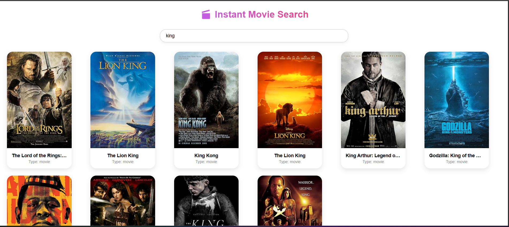

# Instant Movie Search

A sleek and responsive movie search app powered by the [OMDB API](https://www.omdbapi.com/). Built with modern tech stack including React + Vite + TypeScript + Redux Toolkit + RTK Query + i18n + styled-components.



---

## Features

- Instant movie search with debounce
- Detailed movie info on hover
- Internationalization or Localization(i18n)
- Styled with `styled-components`
- Fast and optimized with Vite
- Type-safe with TypeScript
- Powered by Redux Toolkit & RTK Query
- Skeleton loading components

---

## Tech Stack

- React Vite
- TypeScript
- Redux Toolkit + RTK Query
- OMDB API
- styled-components
- i18next for localization
- Responsive CSS

---

## Getting Started

### 1. Clone the repo
``` bash
git clone https://github.com/parallel-minds-assignment/react-hari-patnam.git
cd instant-movie-search
``` 

### 2. Install dependencies
``` bash
npm install
```

### 3. Run the app
``` bash
npm run dev
```